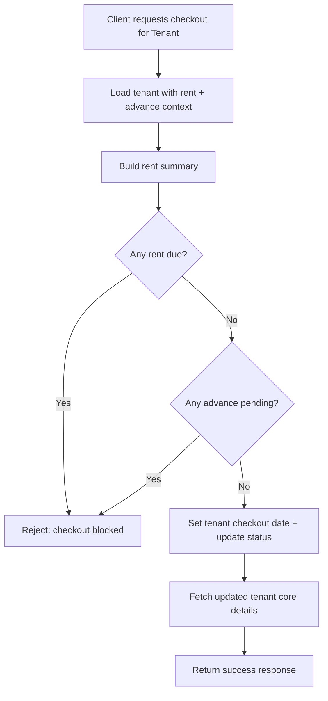

# Tenant Checkout Flow (Mobile API)

## High-level goal

Mark a tenant as checked out only when all dues are settled, then return the updated tenant details.

## Simple flow diagram

## Step-by-step (no code)

1. **Receive request**
   - Checkout is initiated for a specific tenant.

2. **Fetch tenant context**
   - Retrieve tenant details needed to decide if checkout is allowed.
   - This includes rent-cycle/payment information and advance payment information.

3. **Compute outstanding dues**
   - Build a rent summary from the fetched data.
   - Identify if there is any pending rent amount.

4. **Validate advance state**
   - Determine whether advance payment is still pending (or not fully settled).

5. **Decision: allow or block checkout**
   - If **rent due exists** OR **advance is pending**, checkout is blocked and an error is returned.

6. **Perform checkout update**
   - If validations pass, set the checkout date and update tenant state accordingly.

7. **Return updated tenant**
   - Fetch the updated tenant core information and return it in a success response.

## Key rules

- Checkout is **not allowed** when:
  - There is any **pending rent due**, or
  - **Advance** is pending / not fully settled.

- Checkout is **allowed** only when:
  - Rent due is `0`, and
  - Advance requirements are satisfied.
