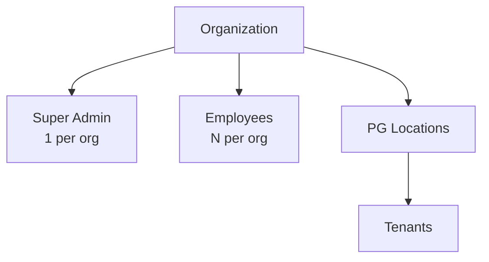
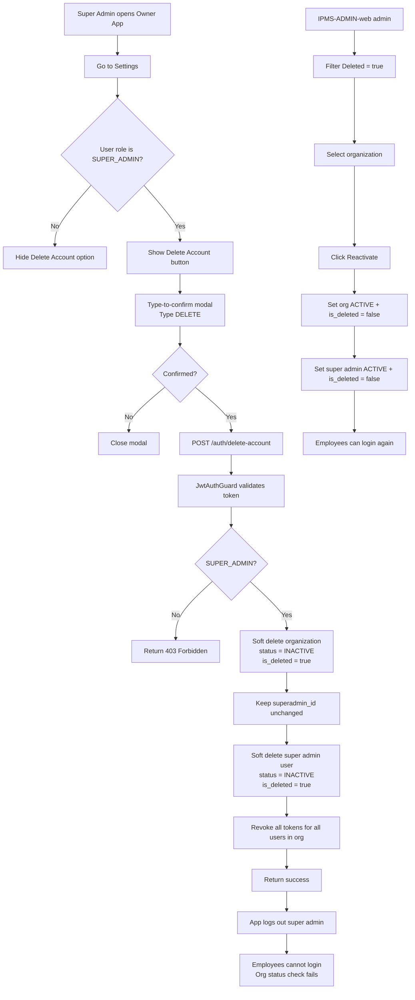

# Owner Delete Account Flow

## App hierarchy (root = organization)

- **Organization** is the root node. It owns all PG locations, employees, tenants and financial records.
- **Super Admin** is the only owner-level user who can delete the account. There is exactly one per organization.
- **Employees** belong to the organization but cannot delete their own accounts.
- **Tenants** belong to a PG location. Tenant self-deletion is not supported.

## High-level goal

Allow the super admin (PG owner) to delete their own account. Because the organization is the root and the super admin is the only one who controls it, the organization is soft-deleted and all owner/employee logins are immediately blocked. Employees and tenant records are **not** touched. The `organization.superadmin_id` is kept so the account and organization can be reactivated from `IPMS-ADMIN-web` in one step.

## Flow diagram

## Step-by-step

1. **Request initiation**
   - Only a user whose role is `SUPER_ADMIN` sees the **Delete Account** option in the owner app.

2. **Client confirmation**
   - A modal explains the consequences.
   - The user must type `DELETE` to confirm.

3. **API call**
   - `POST /auth/delete-account` is called with a valid JWT access token.

4. **Authentication & authorization**
   - `JwtAuthGuard` validates the token.
   - The service verifies the authenticated user belongs to role `SUPER_ADMIN`.
   - If not, a `403 Forbidden` is returned.

5. **Soft delete the organization (root)**
   - `organization.status` is set to `INACTIVE`.
   - `organization.is_deleted` is set to `true`.
   - `organization.deleted_at` and `organization.deleted_by` are recorded.
   - **`organization.superadmin_id` is kept unchanged** so the same super admin can be reactivated.

6. **Soft delete the super admin user**
   - The super admin's `users` record is marked `is_deleted = true` and `status = 'INACTIVE'`.

7. **Token revocation**
   - All active tokens for **every user in the organization** (super admin + employees) are marked `is_revoked = true`.

8. **Login & token guards**
   - `sendOtp`, `verifyOtp`, and `refreshTokens` check the user's organization status and reject if it is `INACTIVE` or `is_deleted`.
   - `JwtTokenService.verifyAccessToken` also checks `organization.status` and `is_deleted`, so any existing owner/employee token is rejected immediately.
   - Tenant logins are handled separately and are not affected by the organization deletion decision.

9. **Client logout**
   - On success, the app clears local auth state and redirects to the login screen.

10. **Re-signup prevention**
    - `send-signup-otp` blocks any phone number that is already linked to an existing user, including a deleted/inactive super admin.
    - If the phone belongs to a deleted account, the error tells the user to contact support for reactivation instead of signing up again.

11. **Recovery / reactivation (IPMS-ADMIN-web)**
    - An admin opens `IPMS-ADMIN-web` → Organizations → filters **Deleted = Yes**.
    - The admin selects a deleted organization and clicks **Reactivate**.
    - `POST /organizations/:id/reactivate` runs a transaction:
      - `organization.status = 'ACTIVE'`, `organization.is_deleted = false`, `organization.deleted_at = null`, `organization.deleted_by = null`.
      - The super admin (`organization.superadmin_id`) is restored: `users.status = 'ACTIVE'`, `users.is_deleted = false`.
    - Existing employees can now log in again because the organization is active.

12. **Admin-side deletion (IPMS-ADMIN-web)**
    - An admin can also delete an organization from the admin panel.
    - In **Organizations**, active organizations show a red **Delete** icon in the Actions column.
    - Inside the organization details page, there is a **Delete** button next to the status badge.
    - `POST /organizations/:id/delete` is called with the admin's `x-user-id` header.
    - It performs the same soft delete, super admin deactivation, and token revocation as the owner-initiated delete.
    - The organization is then listed under **Deleted = Yes** and can be reactivated.

## Key rules

- **Only** the `SUPER_ADMIN` can trigger owner account deletion.
- **`organization.superadmin_id` is not removed** during deletion — it is kept so the same super admin can be reactivated.
- **Employees** cannot delete their own accounts.
- **Tenants** cannot delete their own accounts.
- The **organization is the root**, so deleting it blocks owner/employee access for everyone in the organization.
- **Employee and tenant records remain** in the database and are not soft-deleted.
- **All tokens in the organization are revoked** to force immediate logout of super admin and employees.
- **Login, token refresh and token verification** all check organization status.
- **Re-signup with the same phone number is blocked** when an owner account (active or deleted) exists.
- **Re-enabling the organization is a one-step admin action** in `IPMS-ADMIN-web` that reactivates both the organization and the original super admin.
